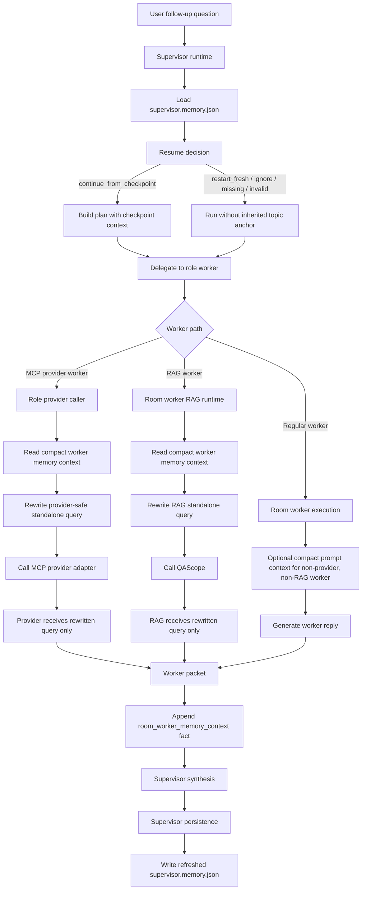
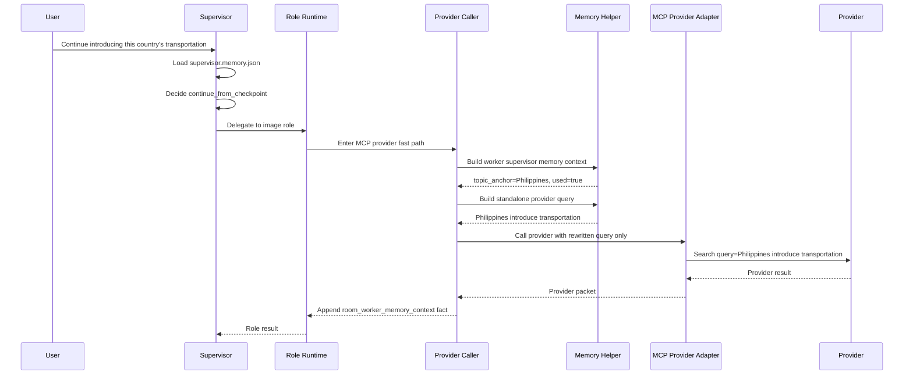
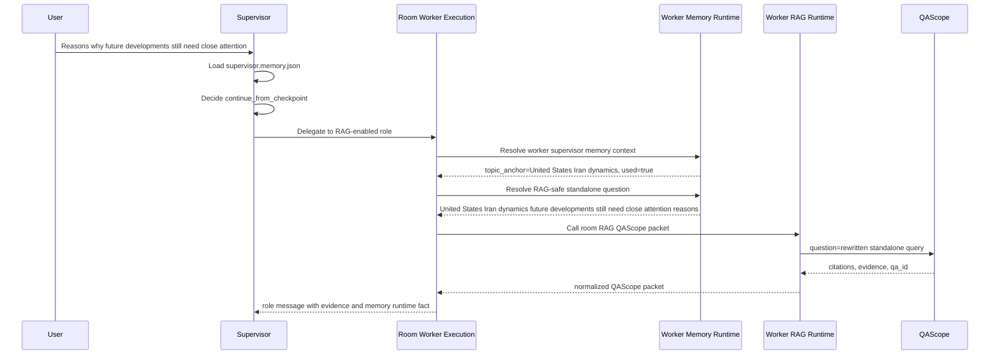

# NISB Room Worker Side Memory Pipeline

Date: 2026-06-11  
Status: Release candidate  
Scope: Supervisor side memory, MCP provider workers, RAG/QAScope workers, and regular room workers

## 1. Purpose

NISB Room Worker Side Memory turns the supervisor sidecar memory into a shared, read-only context source for room workers.

The pipeline is designed as a general-purpose runtime feature. It is not a city-specific, travel-specific, or provider-specific patch.

It supports contextual continuation across arbitrary topics, including:

- Countries
- Cities
- Companies
- Projects
- Plans
- Papers
- Code repair tasks
- Product research
- People
- Events
- Documents
- RAG retrieval
- MCP providers
- Image search providers

The core rule is simple:

- The supervisor writes room side memory.
- Workers may read a compact memory capsule.
- Workers must not write side memory.
- Providers and RAG engines must not receive the full memory block.
- Providers and RAG engines only receive a rewritten standalone task or query.

## 2. Runtime Guarantees

The side memory pipeline enforces the following boundaries:

- `supervisor.memory.json` is the room sidecar memory.
- The supervisor is the only writer of `supervisor.memory.json`.
- Workers are read-only consumers of a compact memory capsule.
- MCP providers do not read `supervisor.memory.json`.
- RAG/QAScope does not read `supervisor.memory.json`.
- Provider adapters remain memory-unaware.
- Provider presets remain memory-unaware.
- RAG retrieval receives only a standalone query.
- MCP providers receive only a provider-safe standalone query.
- `continue_from_checkpoint` is the only decision that may expose the previous `topic_anchor`.
- `restart_fresh`, `ignore_stale_checkpoint`, `missing`, and `invalid` must not inherit the previous `topic_anchor`.
- Notebook write policy must not block worker read-only memory.
- No worker-specific memory file is created.
- No raw side memory JSON is injected into provider or RAG requests.

## 3. High-Level Architecture



## 4. Sidecar Memory

The room sidecar memory is stored at:

```text
_room_supervisor_notebooks/supervisor.memory.json
```

It contains a compact checkpoint rather than a full transcript.

Typical checkpoint fields include:

- `stage`
- `summary`
- `last_step`
- `recovery_hint`
- `topic_anchor`
- `last_question`
- `recent_summary`
- `next_actions`
- `open_questions`
- `resume`
- `updated_at`

The sidecar is intentionally owned by the supervisor. Workers do not mutate it.

## 5. Resume Decision

The supervisor reads the sidecar and classifies the current user request.

The decision may be:

- `continue_from_checkpoint`
- `restart_fresh`
- `ignore_stale_checkpoint`
- `none`
- `checkpoint_missing`
- `checkpoint_invalid`

Only `continue_from_checkpoint` enables the previous checkpoint to be used by workers.

When the decision is not `continue_from_checkpoint`, worker memory context must either be unavailable or marked unused.

Decision examples:

| Previous topic | New question | Expected decision |
|---|---|---|
| Philippines | Continue introducing this country's transportation | `continue_from_checkpoint` |
| Dali | Continue introducing this city's food | `continue_from_checkpoint` |
| OpenAI | Continue checking this company's competitors | `continue_from_checkpoint` |
| Iran situation | Continue explaining why this situation is complex | `continue_from_checkpoint` |
| Dali | Introduce Bangkok food | `restart_fresh` |
| Iran situation | What is the complexity of the situation? | Conservative classification is allowed |
| Missing checkpoint | Continue explaining this topic | No inherited topic anchor |

## 6. Worker Memory Capsule

Workers do not receive the full sidecar memory.

Instead, they receive a compact memory capsule built by the shared memory helpers.

A compact worker memory context may include:

- `used`
- `decision`
- `reason`
- `relative_path`
- `source_kind`
- `topic_anchor`
- `last_question`
- `recent_summary`
- `recovery_hint`
- `next_actions`
- `open_questions`
- `resume_confidence`
- `resume_relation`
- `resume_context_dependent`
- `context_text`

The `context_text` field is only for internal worker prompt composition in safe non-provider, non-RAG paths.

It must not be sent to:

- MCP providers
- Provider adapters
- Pexels
- Exa
- Serper
- arXiv
- QAScope
- RAG retrieval

## 7. MCP Provider Pipeline

### 7.1 Successful MCP Flow

Example:

```text
User: Continue introducing this country's transportation
Previous topic_anchor: Philippines
Rewritten provider query: Philippines introduce transportation
Provider: Pexels
```

The MCP provider pipeline:



### 7.2 MCP Provider Invariants

MCP providers must receive:

```text
Philippines introduce transportation
```

They must not receive:

```text
Continue introducing this country's transportation
```

when memory continuation is resolved.

They also must not receive:

```text
supervisor.memory.json
raw checkpoint JSON
full room memory block
auth tokens
grant metadata
filesystem paths
runtime control blocks
```

### 7.3 Validated MCP Example

Validated behavior:

```text
Original follow-up:
Continue introducing this country's transportation

Checkpoint topic_anchor:
Philippines

Provider-safe rewritten query:
Philippines introduce transportation

Pexels result:
Found images related to "Philippines introduce transportation"
```

This confirms that the provider received a standalone query rather than the raw contextual follow-up.

## 8. RAG Worker Pipeline

### 8.1 Successful RAG Flow

Example:

```text
First question:
Introduce United States and Iran dynamics

Second question:
Reasons why future developments still need close attention

Previous topic_anchor:
United States Iran dynamics

Rewritten RAG query:
United States Iran dynamics future developments still need close attention reasons
```

The RAG worker pipeline:



### 8.2 Validated RAG Evidence

Validated role event:

```text
mode_used = cite
evidence_tools = ["nisb_qascope_ask"]
citations = non-empty
qa_id = non-empty
evidence_query = United States Iran dynamics future developments still need close attention reasons
```

This confirms that the RAG worker entered QAScope and searched with a standalone query derived from side memory.

### 8.3 RAG Invariants

QAScope receives:

```text
United States Iran dynamics future developments still need close attention reasons
```

QAScope must not receive:

```text
Full supervisor side memory
Full checkpoint JSON
Raw memory capsule
Provider grants
Room runtime control metadata
Bearer tokens
Filesystem paths
```

## 9. Regular Worker Pipeline

Regular non-provider, non-RAG workers may optionally receive a compact memory prompt.

This path is intentionally separate from MCP provider and RAG query rewriting.

Allowed:

```text
Compact context text + current worker task
```

Not allowed:

```text
Writing supervisor.memory.json
Creating worker-specific memory files
Injecting full sidecar JSON
```

This path exists for ordinary role replies and fallback behavior.

It must not be used to justify memory injection into provider or RAG calls.

## 10. Implementation Files

### 10.1 Supervisor Runtime

```text
tools/rooms_shared/supervisor_runtime/memory_resume_paths.py
```

Responsibilities:

- Resolve sidecar memory paths
- Load `supervisor.memory.json`
- Normalize checkpoint and resume metadata
- Return a memory read result

Key functions:

- `load_supervisor_memory_sidecar`
- `resolve_supervisor_memory_path`
- `build_supervisor_memory_relative_path`
- `normalize_memory_checkpoint`
- `normalize_memory_resume`
- `disabled_memory_result`

---

```text
tools/rooms_shared/supervisor_runtime/memory_resume_decision.py
```

Responsibilities:

- Decide whether the current question can continue from checkpoint
- Handle missing, invalid, stale, restart, and contextual follow-up cases
- Return a normalized supervisor memory resume result

Key functions:

- `decide_supervisor_memory_resume`
- `_build_memory_resume_result`
- `_result_from_classifier`

Important boundary:

- Non-continue decisions must not expose or inherit the previous `topic_anchor`.

---

```text
tools/rooms_shared/supervisor_runtime/memory_resume_text.py
```

Responsibilities:

- Normalize text
- Detect contextual follow-ups
- Detect explicit new topics
- Derive topic anchors
- Classify checkpoint relation
- Build compact worker memory context
- Build standalone worker tasks and provider/RAG queries
- Sanitize provider/RAG queries

Key functions:

- `build_worker_supervisor_memory_context`
- `build_worker_standalone_task_from_memory`
- `sanitize_provider_standalone_query`
- `classify_supervisor_memory_resume_context`
- `_looks_like_context_dependent_task`
- `_looks_like_contextual_reference`
- `_has_self_contained_new_topic`
- `_derive_topic_anchor`
- `_classify_checkpoint_relation`

Important boundary:

- This module must remain general-purpose and internationalized.
- It must not become a hardcoded city/travel patch.

---

```text
tools/rooms_shared/supervisor_runtime/memory_resume.py
```

Responsibilities:

- Facade and export layer
- Expose shared memory helpers to supervisor runtime, worker runtime, MCP provider caller, and RAG runtime

Key exports:

- `build_worker_supervisor_memory_context`
- `build_worker_standalone_task_from_memory`
- `sanitize_provider_standalone_query`
- `classify_supervisor_memory_resume_context`
- `decide_supervisor_memory_resume`
- `load_supervisor_memory_sidecar`
- `write_supervisor_memory_sidecar`
- `build_supervisor_memory_checkpoint`

---

```text
tools/rooms_shared/supervisor_runtime/memory_resume_write.py
```

Responsibilities:

- Build supervisor memory checkpoint
- Write `supervisor.memory.json`
- Add resume metadata
- Prevent topic anchor pollution

Key functions:

- `build_supervisor_memory_checkpoint`
- `write_supervisor_memory_sidecar`
- `augment_plan_summary_with_memory_resume`

Important boundaries:

- `continue_from_checkpoint` may inherit the previous anchor.
- `restart_fresh`, `ignore_stale_checkpoint`, `missing`, and `invalid` must not inherit the previous anchor.
- New checkpoints should be derived from the current explicit task and final text.
- Provider noise must not overwrite the topic anchor.

## 11. Worker Runtime Files

### 11.1 room_worker_memory_runtime.py

```text
tools/rooms_shared/room_worker_memory_runtime.py
```

Responsibilities:

- Build worker supervisor memory context
- Stamp memory metadata into request args
- Resolve provider-safe standalone questions
- Resolve RAG-safe standalone questions
- Append `room_worker_memory_context` runtime facts

Key functions:

- `resolve_worker_supervisor_memory_context`
- `stamp_worker_memory_request_args`
- `resolve_provider_safe_worker_question`
- `resolve_rag_safe_worker_question`
- `append_worker_memory_runtime_fact`

This file is the shared worker-side memory utility layer.

It does not call providers directly.

It does not call QAScope directly.

It does not write side memory.

### 11.2 room_worker_rag_runtime.py

```text
tools/rooms_shared/room_worker_rag_runtime.py
```

Responsibilities:

- Call QAScope using a rewritten standalone RAG question
- Normalize QAScope result into a room packet
- Ensure `evidence_query` remains equal to the rewritten query
- Keep QAScope memory-unaware

Key function:

- `call_room_rag_qascope_packet`

Important boundary:

- This module receives the rewritten RAG question.
- It does not read `supervisor.memory.json`.
- It does not receive the full memory block.
- It does not decide resume behavior.

### 11.3 room_worker_execution.py

```text
tools/rooms_shared/room_worker_execution.py
```

Responsibilities:

- General room worker execution dispatcher
- Enforce execution gate
- Prepare role binding and RAG mode
- Dispatch MCP provider worker path when applicable
- Dispatch RAG/QAScope worker path when applicable
- Dispatch regular chat/fallback worker path when applicable
- Attach memory runtime facts

Key functions:

- `_execute_room_worker_packet`
- `_execute_room_worker_text`
- `_call_room_mcp_provider`
- `_compose_worker_memory_prompt`
- `_resolve_provider_safe_worker_question`
- `_append_worker_memory_runtime_fact`

Current role:

- Still required for LLM worker, fallback worker, and RAG worker paths.
- No longer contains all memory implementation details.
- Delegates shared memory logic to `room_worker_memory_runtime.py`.
- Delegates RAG packet handling to `room_worker_rag_runtime.py`.

## 12. Role Runtime Files

### 12.1 room_role_runtime_request.py

```text
tools/rooms_shared/room_role_runtime_request.py
```

Responsibilities:

- Main role reply runtime entry
- Build role request args
- Decide whether the role should use the MCP provider fast path
- Call the role MCP provider packet path
- Call the ordinary AI worker packet path when provider fast path is not used

Key functions:

- `_generate_role_reply_packet`
- `_call_room_ai_reply_packet`

Current status:

- Does not own memory rewrite logic.
- Correctly routes provider fast path to `room_role_runtime_provider_call.py`.
- Routes non-provider workers toward `room_worker_execution.py`.

### 12.2 room_role_runtime_provider_call.py

```text
tools/rooms_shared/room_role_runtime_provider_call.py
```

Responsibilities:

- Unified MCP provider fast-path caller for role workers
- Read compact worker memory context
- Rewrite contextual follow-up into provider-safe standalone query
- Call provider adapter with rewritten query only
- Append worker memory runtime fact

Key functions:

- `_call_role_room_mcp_provider_packet`
- `_resolve_role_provider_memory_question`
- `_append_role_provider_memory_fact`

This file is the key MCP provider memory bridge.

Provider adapters remain memory-unaware.

## 13. Provider Files

### 13.1 room_mcp_provider_adapter.py

```text
tools/rooms_shared/room_mcp_provider_adapter.py
```

Responsibilities:

- Dispatch room MCP providers
- Receive explicit question/query
- Return provider result packet

Boundary:

- Does not read memory.
- Does not classify follow-ups.
- Does not rewrite queries.
- Receives a finalized standalone query from the caller.

### 13.2 Provider Implementations

```text
tools/rooms_shared/room_mcp_provider_pexels.py
tools/rooms_shared/room_mcp_provider_exa.py
tools/rooms_shared/room_mcp_provider_serper.py
tools/rooms_shared/room_mcp_provider_arxiv.py
```

Responsibilities:

- Execute external provider calls
- Consume query parameters
- Return provider-specific results

Boundary:

- No memory awareness.
- No sidecar reads.
- No checkpoint logic.

### 13.3 room_mcp_provider_presets.py

```text
tools/rooms_shared/room_mcp_provider_presets.py
```

Responsibilities:

- Declare provider schema
- Declare provider defaults
- Declare capabilities, auth, and boundary hints

Boundary:

- Does not participate in memory resume.
- Does not perform standalone rewrite.
- Must not be used as the place to inject memory logic.

## 14. RAG/QAScope Files

### 14.1 room_qascope.py

```text
tools/rooms_shared/room_qascope.py
```

Responsibilities:

- Load QAScope callable
- Build QAScope payload
- Apply binding scope
- Apply time filter and R3 parameters
- Extract QAScope result
- Return citations and evidence metadata

Key functions:

- `_call_qascope_reply`
- `_extract_qascope_result`

Boundary:

- Receives the rewritten standalone RAG question.
- Does not read side memory.
- Does not classify checkpoint continuation.
- Does not receive raw memory blocks.

## 15. Packet and Projection Files

### 15.1 room_packet_builder.py

```text
tools/rooms_shared/room_packet_builder.py
```

Responsibilities:

- Build formal room packets
- Normalize QAScope packets
- Build empty evidence results
- Bridge chat results

Relevant functions:

- `_normalize_qascope_packet`
- `_ensure_formal_packet`
- `_empty_evidence_result`
- `_bridge_chat_result`

Boundary:

- `evidence_query` should remain aligned with the rewritten standalone provider/RAG query when one is used.

### 15.2 room_role_runtime_packets.py

```text
tools/rooms_shared/room_role_runtime_packets.py
```

Responsibilities:

- Normalize role runtime packets
- Preserve runtime facts
- Append role runtime observability

Boundary:

- Must not drop `room_worker_memory_context` facts.

## 16. Supervisor Orchestration Files

### 16.1 room_orchestrator_supervisor_flow.py

```text
tools/rooms_shared/room_orchestrator_supervisor_flow.py
```

Responsibilities:

- Supervisor orchestration flow
- Memory read
- Resume decision integration
- Delegate plan generation
- Plan summary observability

Current status:

- Shows `continue_from_checkpoint` in traces.
- Provides the supervisor-side proof that memory resume is active.

### 16.2 room_orchestrator_delegate_flow.py

```text
tools/rooms_shared/room_orchestrator_delegate_flow.py
```

Responsibilities:

- Delegate supervisor tasks to roles
- Generate delegate summary
- Connect supervisor plan to role runtime

Current status:

- Not a memory implementation file.
- Useful for locating role message event IDs during validation.

### 16.3 room_orchestrator_supervisor_persistence.py

```text
tools/rooms_shared/room_orchestrator_supervisor_persistence.py
```

Responsibilities:

- Trigger supervisor memory write after synthesis/finalization
- Attach memory read/resume/write traces
- Persist refreshed checkpoint

Boundary:

- Must continue writing `supervisor.memory.json`.
- Must not allow stale anchors to pollute new checkpoints.

## 17. Runtime Facts

The pipeline emits a memory runtime fact:

```text
room_worker_memory_context
```

Recommended fields:

```json
{
  "type": "room_worker_memory_context",
  "worker_memory_context_available": true,
  "worker_memory_context_used": true,
  "worker_memory_text_injected": false,
  "worker_memory_original_question": "Reasons why future developments still need close attention",
  "worker_memory_provider_question_resolved": false,
  "worker_memory_provider_question": "",
  "worker_memory_provider_question_reason": "",
  "worker_memory_rag_question_resolved": true,
  "worker_memory_rag_question": "United States Iran dynamics future developments still need close attention reasons",
  "worker_memory_rag_question_reason": "contextual_followup_rewritten",
  "worker_memory_decision": "continue_from_checkpoint",
  "worker_memory_reason": "implicit_contextual_followup",
  "worker_memory_source": "_room_supervisor_notebooks/supervisor.memory.json",
  "worker_memory_source_kind": "room_sidecar",
  "worker_memory_topic_anchor": "United States Iran dynamics",
  "worker_memory_resume_confidence": "high",
  "worker_memory_resume_relation": "same_topic",
  "worker_memory_resume_context_dependent": true
}
```

MCP provider workers should use:

```text
worker_memory_provider_question_resolved
worker_memory_provider_question
worker_memory_provider_question_reason
```

RAG workers should use:

```text
worker_memory_rag_question_resolved
worker_memory_rag_question
worker_memory_rag_question_reason
```

Regular workers may use:

```text
worker_memory_text_injected
```

## 18. Validation Matrix

### 18.1 MCP / Pexels / Country

First question:

```text
Introduce the Philippines
```

Second question:

```text
Continue introducing this country's transportation
```

Expected:

```text
supervisor_memory_resume.decision = continue_from_checkpoint
topic_anchor = Philippines
provider query = Philippines introduce transportation
provider does not receive memory block
worker_memory_provider_question_resolved = true
```

### 18.2 MCP / Pexels / City

First question:

```text
Introduce Dali
```

Second question:

```text
Continue introducing this city's food
```

Expected:

```text
provider query = Dali food
or
provider query = Dali introduce food
```

The query must not remain:

```text
Continue introducing this city's food
```

### 18.3 MCP / Exa / Company

First question:

```text
Introduce OpenAI
```

Second question:

```text
Continue checking this company's major competitors
```

Expected:

```text
provider query = OpenAI major competitors
provider does not receive memory block
```

### 18.4 RAG / Geopolitics

First question:

```text
Introduce United States and Iran dynamics
```

Second question:

```text
Reasons why future developments still need close attention
```

Expected:

```text
supervisor_memory_resume.decision = continue_from_checkpoint
mode_used = cite
evidence_tools = ["nisb_qascope_ask"]
citations = non-empty
evidence_query = United States Iran dynamics future developments still need close attention reasons
qa_id = non-empty
worker_memory_rag_question_resolved = true
```

### 18.5 RAG / Project

First question:

```text
Introduce NISB Room runtime
```

Second question:

```text
Continue analyzing this project's risks
```

Expected:

```text
RAG query = NISB Room runtime risks
```

### 18.6 RAG / Paper

First question:

```text
Introduce Attention is All You Need
```

Second question:

```text
Continue explaining this paper's core contributions
```

Expected:

```text
RAG query = Attention is All You Need core contributions
```

### 18.7 New Topic Restart

First question:

```text
Introduce Dali
```

Second question:

```text
Introduce Bangkok food
```

Expected:

```text
decision = restart_fresh
previous topic_anchor is not inherited
query = Introduce Bangkok food
```

### 18.8 Missing Checkpoint

Input:

```text
Continue introducing this country's transportation
```

Precondition:

```text
supervisor.memory.json is missing or invalid
```

Expected:

```text
decision = checkpoint_missing or checkpoint_invalid
worker_memory_context_used = false
provider/RAG query does not fabricate a country
```

### 18.9 Stale Checkpoint

Precondition:

```text
checkpoint is stale or invalidated
```

Expected:

```text
decision = ignore_stale_checkpoint
worker_memory_context_used = false
previous topic_anchor is not inherited
```

## 19. Forbidden Designs

The following designs are explicitly forbidden:

- Passing `supervisor.memory.json` to a provider.
- Passing raw memory JSON to QAScope.
- Embedding full room side memory into provider queries.
- Embedding full room side memory into RAG queries.
- Expanding city-specific or travel-specific keyword patches as the primary mechanism.
- Making provider adapters read side memory.
- Making provider presets read side memory.
- Creating separate memory files for each worker.
- Allowing workers to write `supervisor.memory.json`.
- Using `notebook_write_enabled` to block worker read-only memory.
- Allowing `restart_fresh` to inherit the previous topic anchor.
- Allowing `ignore_stale_checkpoint` to inherit the previous topic anchor.
- Extracting new topic anchors blindly from provider noise.
- Sending auth tokens, grants, filesystem paths, or runtime control metadata into provider/RAG queries.

## 20. Release Evidence

### 20.1 MCP Provider Evidence

Validated MCP behavior:

```text
Original follow-up:
Continue introducing this country's transportation

Checkpoint topic_anchor:
Philippines

Rewritten query:
Philippines introduce transportation

Provider:
Pexels

Observed behavior:
Pexels searched using the rewritten standalone query.
```

### 20.2 RAG Worker Evidence

Validated RAG behavior:

```text
Original follow-up:
Reasons why future developments still need close attention

Checkpoint topic_anchor:
United States Iran dynamics

Rewritten evidence_query:
United States Iran dynamics future developments still need close attention reasons

Observed:
mode_used = cite
evidence_tools = ["nisb_qascope_ask"]
citations = non-empty
qa_id = non-empty
```

This proves that the RAG worker searched using a standalone query rather than the raw contextual follow-up.

## 21. Release Checklist

Before release, verify:

- Supervisor memory read succeeds.
- Supervisor memory resume decision is visible in trace.
- `continue_from_checkpoint` works for contextual follow-ups.
- `restart_fresh` does not inherit old anchors.
- `ignore_stale_checkpoint` does not inherit old anchors.
- MCP provider receives rewritten standalone query.
- RAG/QAScope receives rewritten standalone query.
- Providers do not receive raw memory blocks.
- QAScope does not receive raw memory blocks.
- `room_worker_memory_context` fact is preserved.
- Provider and RAG memory fields are separated.
- QAScope failures are not silently swallowed without trace.
- Existing external MCP publish behavior is unchanged.
- Imported remote provider behavior is unchanged.
- Provider registry and provider presets are unchanged.
- Supervisor memory write still succeeds.
- Notebook write denial does not block worker read-only memory.

## 22. Known Follow-Ups

### 22.1 Classifier Upgrade

The current context-dependent classifier is deterministic.

It may later be upgraded to a model-backed classifier.

Any upgrade must preserve these boundaries:

- Providers remain memory-unaware.
- RAG remains memory-unaware.
- Non-continue decisions do not inherit old anchors.
- Output is sanitized before provider/RAG use.

### 22.2 Standalone Rewriter Upgrade

The current standalone rewrite is lightweight and deterministic.

It may later be upgraded to a model-backed rewriter.

Any upgrade must preserve these boundaries:

- Rewriter output must be short.
- Rewriter output must be sanitized.
- Rewriter output must not contain raw memory JSON.
- Rewriter output must not contain credentials, grants, paths, or runtime control data.

### 22.3 Final Citation Projection

Role events may contain RAG citations while the final supervisor event is projected as a supervisor direct reply.

This is a separate product/runtime projection issue.

It should be tracked separately from worker side memory.

Suggested issue title:

```text
Room Final Citation Projection Follow-up
```

Suggested location:

```text
docs/engineering-notes/Room_Final_Citation_Projection_Followup.md
```

## 23. Current Status

Current release status:

```text
Supervisor side memory: validated
MCP provider worker side memory: validated
RAG worker side memory: validated
Provider memory isolation: validated
RAG memory isolation: validated
Worker read-only boundary: validated
Remaining work: observability polish and final citation projection follow-up
```
